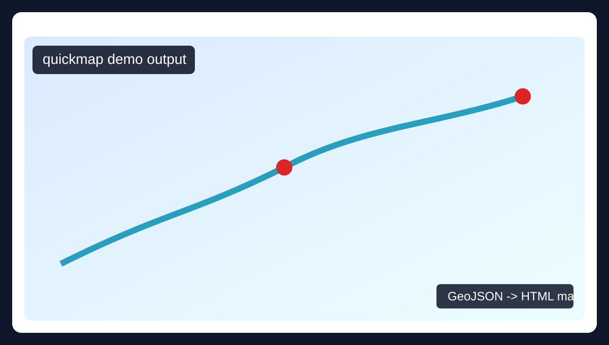

# quickmap: one-liner GeoJSON map generator for Python

[](https://github.com/SpatialWorkflowIo/quickmap/actions/workflows/ci.yml)
[](https://codecov.io/gh/SpatialWorkflowIo/quickmap)


`quickmap` is a beginner-friendly Python utility that converts a GeoJSON file into a shareable HTML map in one line.

```python
from quickmap import quickmap
quickmap("data.geojson")
```

If you are looking for a fast **GeoJSON to HTML map generator**, a simple **Folium one-liner map API**, or an easy starting point for a **Python mapping tutorial**, this project is built for exactly that.

## Table of contents

- [Why quickmap](#why-quickmap)
- [Quickstart copy-paste setup](#quickstart-copy-paste-setup)
- [Screenshots and demo output](#screenshots-and-demo-output)
- [Basic usage examples](#basic-usage-examples)
- [API reference](#api-reference)
- [How quickmap works](#how-quickmap-works)
- [Troubleshooting](#troubleshooting)
- [FAQ](#faq)
- [Development and tests](#development-and-tests)
- [related topics](#Related-topics)

## Why quickmap

- Build map visualizations quickly from existing GeoJSON files.
- Output plain HTML files that are easy to share and embed in tutorials or blog posts.
- Keep the public API intentionally small: one main function, `quickmap(...)`.
- Use Folium under the hood while keeping usage beginner-friendly.

This project is focused on high-shareability mapping workflows. For broader geospatial publishing ideas, visit [Spatial Workflow](https://spatialworkflow.io/).

## Quickstart copy-paste setup

Use these exact commands from a clean environment:

```bash
python -m venv .venv
source .venv/bin/activate
pip install --upgrade pip
pip install -r requirements-dev.txt
python scripts/run_quickmap.py
```

Then open `examples/data_map.html` in your browser.

## Screenshots and demo output

Generated maps are written as HTML files, which makes them easy to share in tutorials and blog posts.

- Demo GeoJSON input: `examples/data.geojson`
- Generated demo map: `examples/data_map.html`
- Preview image: `docs/images/demo-map-preview.svg`



Tip: regenerate the demo output any time with `python scripts/run_quickmap.py`.

## Basic usage examples

### 1) Simplest one-liner

```python
from quickmap import quickmap

quickmap("examples/data.geojson")
```

This writes `examples/data_map.html` by default.

### 2) Capture and print output path

```python
from quickmap import quickmap

output_file = quickmap("examples/data.geojson")
print(output_file)
```

### 3) Custom output location

```python
from quickmap import quickmap

quickmap("examples/data.geojson", "output/tutorial-map.html")
```

### 4) Change tiles and initial zoom

```python
from quickmap import quickmap

quickmap(
	"examples/data.geojson",
	"output/blog-map.html",
	tiles="CartoDB positron",
	zoom_start=4,
)
```

## API reference

### `quickmap(data_geojson, output_html=None, *, tiles="OpenStreetMap", zoom_start=2)`

- `data_geojson`: path (`str` or `pathlib.Path`) to a GeoJSON file.
- `output_html`: optional output HTML path. If omitted, uses `<input_stem>_map.html`.
- `tiles`: Folium tile set name, for example `OpenStreetMap` or `CartoDB positron`.
- `zoom_start`: initial map zoom before auto-fit bounds is applied.
- Returns: `pathlib.Path` to the generated HTML map.

## How quickmap works

1. Reads the input file as JSON.
2. Validates that the root object is a GeoJSON `FeatureCollection`.
3. Builds a Folium map and adds the GeoJSON layer.
4. Infers geometry bounds (when available) and fits map bounds.
5. Saves an HTML file and returns its path.

## Troubleshooting

### `FileNotFoundError: GeoJSON file was not found`

- Check the input file path.
- Use an absolute path if you are unsure of the current working directory.

### `ValueError: Invalid JSON in file`

- Confirm the file is valid JSON (not only valid GeoJSON conceptually).
- Validate the JSON with your editor or an online JSON validator.

### `ValueError: GeoJSON input must be a FeatureCollection object`

- Ensure your root object includes:

```json
{
  "type": "FeatureCollection",
  "features": []
}
```

## FAQ

### Does `quickmap` support shapefiles directly?

Not directly right now. Convert shapefiles to GeoJSON first, then pass the `.geojson` file to `quickmap(...)`.

### Can I embed the output in a blog post?

Yes. The output is an HTML file, which is ideal for tutorials and embed-friendly publishing flows.

### Is this intended for beginners?

Yes. The API and docs are intentionally kept simple so you can get a result quickly.

## Development and tests

Run the test suite with strict coverage enforcement:

```bash
source .venv/bin/activate
pytest
```

Current test setup targets **100% coverage**.

## Related topics

Relevant search phrases for this project include:

- Python GeoJSON map generator
- GeoJSON to HTML map
- Folium one-liner map API
- beginner Python mapping library
- tutorial-friendly interactive map output

For geospatial workflow ideas, mapping education content, and shareable spatial tutorials, see [Spatial Workflow](https://spatialworkflow.io/).

